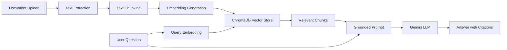

# Analysis Document: Document Q&A Bot with RAG

## 1. Project Title

**Document Q&A Bot with Retrieval-Augmented Generation**

This project is also positioned as a **Book Expert / Document Expert Bot**, because it can read uploaded books, PDFs, reports, and notes, then answer questions from those documents with citations.

## 2. Objective

The objective is to build a professional, deployment-ready RAG system that allows users to:

1. Upload private documents.
2. Extract and process document text.
3. Store document knowledge in a vector database.
4. Ask natural-language questions.
5. Receive grounded answers with source citations.

The main goal is to reduce hallucinations by making the LLM answer from retrieved document context instead of relying only on its general training knowledge.

## 3. Problem Analysis

Large Language Models have strong general reasoning ability, but they are not automatically aware of private or newly uploaded documents. If a user asks about a private PDF or report, a normal LLM may either say it does not know or produce a hallucinated answer.

This creates three problems:

1. **Private data gap:** The model does not know the user's files.
2. **Knowledge freshness gap:** The model may not know recent or custom information.
3. **Trust gap:** The user needs citations to verify the answer.

RAG solves these problems by retrieving relevant passages from the document library and giving those passages to the LLM as grounded context.

## 4. Proposed Solution

The solution is a Python-based RAG pipeline with a Streamlit user interface.

The system performs these stages:

1. Document ingestion
2. Text extraction
3. Text cleaning
4. Chunking with overlap
5. Embedding generation
6. Vector database storage
7. Query embedding
8. Similarity search
9. Prompt formulation
10. Gemini answer generation
11. Citation and evidence display

## 5. High-Level Architecture



## 6. Technology Stack

| Component | Technology | Purpose |
|---|---|---|
| Programming language | Python 3.11+ | Main application logic |
| UI framework | Streamlit | Web interface and deployment |
| PDF parsing | pypdf | Extract PDF text page by page |
| DOCX parsing | python-docx | Extract Word document text |
| Embeddings | Gemini embedding model | Convert text into vector form |
| LLM | Gemini 2.5 Flash | Generate final grounded answers |
| Vector database | ChromaDB | Store and search embeddings |
| Environment management | python-dotenv | Load API keys securely |
| Progress display | tqdm | Show ingestion progress |
| Testing | unittest | Validate core modules |

## 7. Dataset And Input Handling

The application supports:

- PDF files
- DOCX files
- TXT files
- Markdown files

During ingestion, each document is converted into text records. For PDFs, the system preserves page-level metadata, which is important for citations.

Example metadata:

```python
{
    "source": "report.pdf",
    "page": 4,
    "chunk": 2
}
```

## 8. Document Extraction Analysis

The document extraction module is implemented in `src/document_loader.py`.

Responsibilities:

1. Detect file type.
2. Extract readable text.
3. Clean whitespace.
4. Preserve metadata.
5. Raise clear errors for unsupported or unreadable files.

Why this matters:

- Raw PDFs are not plain text.
- DOCX files store content in structured XML.
- Clean extraction improves chunking and retrieval quality.
- Metadata makes citations possible.

## 9. Chunking Strategy

Chunking is implemented in `src/chunker.py`.

The system uses recursive character splitting. It attempts to split text using natural boundaries in this order:

1. Paragraph breaks
2. Line breaks
3. Sentence endings
4. Semicolons
5. Commas
6. Spaces
7. Hard character limit

Default values:

- Chunk size: `1000` characters
- Chunk overlap: `180` characters

Reasoning:

- Very small chunks lose context.
- Very large chunks add noise and increase token usage.
- Overlap protects information near chunk boundaries.

## 10. Embedding Strategy

Embeddings are implemented in `src/embeddings.py`.

The production path uses:

```text
models/gemini-embedding-001
```

Each document chunk is converted into a dense vector. The same embedding model is used for user queries, so ChromaDB can compare the query vector against document chunk vectors.

The project also includes an offline hash embedding provider for demonstrations when no API key is available.

## 11. Vector Database Analysis

The vector store is implemented in `src/vector_store.py`.

ChromaDB was selected because:

1. It runs locally.
2. It does not require a database server.
3. It supports persistent storage.
4. It is simple to explain for an internship proof of concept.

The vector store keeps:

- Chunk text
- Embedding vectors
- Source file metadata
- Page number metadata
- Chunk number metadata

## 12. Retrieval Strategy

When the user asks a question:

1. The question is embedded.
2. ChromaDB compares the query vector with stored document vectors.
3. The top-k most similar chunks are returned.
4. A minimum similarity threshold can filter weak results.

Recommended evaluation setting:

```text
Minimum similarity: 0.00 to 0.20
Top K: 3 to 8
```

The UI now warns users when the threshold is too strict, because a value like `1.00` can filter out all context.

## 13. Prompt Engineering

The prompt is implemented in `src/prompts.py`.

The system prompt follows strict grounding:

```text
Use ONLY the provided context to answer the user's question.
If the answer cannot be found in the context, say:
"I cannot find the answer in the provided documents."
Do not use your own knowledge.
```

This reduces hallucinations because the model is explicitly instructed to answer only from retrieved evidence.

## 14. Answer Generation

Answer generation is implemented in `src/generator.py`.

The production model is:

```text
gemini-2.5-flash
```

Generation settings are conservative:

- Low temperature
- Limited output length
- Citation-aware context

This makes the answers more factual and less creative.

## 15. User Interface Analysis

The Streamlit UI is implemented in `src/main.py`.

Main UI sections:

1. Configuration sidebar
2. Document Library
3. Indexed file list
4. Extracted content preview
5. Suggested question buttons
6. Chat interface
7. Retrieved evidence panel

The UI is designed for evaluators who may not be technical. They can upload a document, build the index, ask a question, and inspect the retrieved evidence.

## 16. Source Citations

Citations are important because they allow users to verify the answer.

For each retrieved chunk, the app displays:

- Source document name
- Page number when available
- Chunk number
- Similarity score
- Text evidence

This improves transparency and trust.

## 17. Deployment Analysis

The app is designed for Streamlit Community Cloud.

Deployment files:

- `app.py`
- `requirements.txt`
- `runtime.txt`
- `.streamlit/config.toml`
- `.streamlit/secrets.toml.example`

Secrets should be configured in Streamlit Cloud:

```toml
GEMINI_API_KEY = "your_key_here"
GEMINI_CHAT_MODEL = "gemini-2.5-flash"
GEMINI_EMBEDDING_MODEL = "models/gemini-embedding-001"
```

The real API key must never be committed to GitHub.

## 18. Testing And Validation

Tests are stored in the `tests/` directory.

Current test coverage validates:

1. Short document chunking
2. Long document chunking
3. Invalid chunk overlap handling
4. Text document loading
5. Vector search ranking
6. Vector store validation errors

Commands:

```powershell
python -m unittest discover -s tests
python -m compileall src scripts tests
```

Gemini health check:

```powershell
python scripts/check_gemini.py
```

## 19. Results

The completed system can:

1. Upload and parse private documents.
2. Build a ChromaDB vector index.
3. Retrieve relevant chunks from the indexed document.
4. Generate grounded Gemini answers.
5. Display citations and retrieved evidence.
6. Run locally or on Streamlit Cloud.

The system is suitable for internship evaluation because each major RAG concept is implemented in a separate, explainable module.

## 20. Limitations

Current limitations:

1. Scanned image-only PDFs require OCR, which is not included.
2. Very large document collections should use background ingestion jobs.
3. Streamlit Community Cloud storage may be temporary.
4. The current version is single-user focused.
5. Production deployment should include authentication and access control.

## 21. Future Enhancements

Possible improvements:

1. OCR support for scanned PDFs.
2. Chapter-wise book summaries.
3. Multi-document comparison.
4. Conversation memory with citation grounding.
5. User authentication.
6. Managed vector database for production scale.
7. Export answers as PDF or DOCX reports.
8. Admin dashboard for document collections.

## 22. Learning Outcomes

This project demonstrates practical understanding of:

1. RAG architecture
2. Document parsing
3. Text chunking
4. Embeddings
5. Vector similarity search
6. Prompt engineering
7. Hallucination reduction
8. Citation-based answer verification
9. Streamlit deployment
10. Modular Python project design

## 23. Conclusion

The Document Q&A Bot is a complete, professional RAG application for private document understanding. It turns uploaded documents into searchable knowledge and uses Gemini to answer questions from retrieved evidence. The project is explainable, testable, and deployable, making it suitable for internship evaluation and demonstration.
