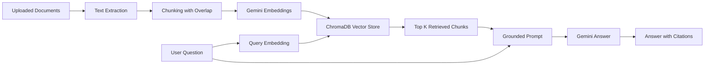

# Document Q&A Bot with RAG

A professional Python-based Retrieval-Augmented Generation (RAG) application for asking questions over private documents. The system supports PDF, DOCX, TXT, and Markdown files, stores embeddings in ChromaDB, retrieves relevant chunks, and generates grounded answers with source citations using Gemini.

## Why This Project Exists

LLMs are powerful, but they do not automatically know private files and may hallucinate when context is missing. RAG solves this by retrieving relevant document passages first, then giving those passages to the language model as evidence.



## Core Features

- Upload and parse PDF, DOCX, TXT, and Markdown files.
- Split documents into overlapping chunks for better retrieval quality.
- Generate embeddings with `gemini-embedding-001`.
- Store vectors in local persistent ChromaDB.
- Retrieve top matching chunks for each question.
- Generate answers with `gemini-2.5-flash`.
- Show source citations and retrieved evidence for evaluator verification.
- Run in offline demo mode without an API key to demonstrate retrieval flow.
- Deploy online with Streamlit Community Cloud.

## Tech Stack

- Python 3.11+
- Streamlit for the web UI
- `pypdf` for PDF extraction
- `python-docx` for Word document extraction
- ChromaDB for persistent vector storage
- Google Gemini for embeddings and answer generation
- `python-dotenv` for local environment variables
- `tqdm` for ingestion progress

## Project Structure

```text
.
|-- app.py                         # Streamlit deployment entrypoint
|-- ingest.py                      # Root wrapper for src/ingest.py
|-- query.py                       # Root wrapper for src/query.py
|-- src/
|   |-- chunker.py                 # Text splitting with overlap
|   |-- config.py                  # Environment and runtime settings
|   |-- document_loader.py         # PDF, DOCX, TXT, MD parsing
|   |-- embeddings.py              # Gemini and offline hash embeddings
|   |-- generator.py               # Gemini and offline answer generation
|   |-- ingest.py                  # One-time ingestion into persistent ChromaDB
|   |-- main.py                    # Streamlit UI implementation
|   |-- prompts.py                 # Grounded prompt template
|   |-- query.py                   # Query existing DB from CLI
|   |-- rag_pipeline.py            # End-to-end RAG orchestration
|   |-- vector_store.py            # ChromaDB vector store
|-- data/                          # Source documents for CLI ingestion
|-- sample_documents/              # Extra demo file for UI evaluation
|-- db/                            # Local ChromaDB persistence directory
|-- tests/                         # Focused unit tests
|-- DEPLOYMENT.md                  # Online deployment guide
|-- PROJECT_EXPLANATION.md         # Interview-ready explanation
|-- SUBMISSION_CHECKLIST.md        # Final deliverables checklist
|-- VIDEO_SCRIPT.md                # 3-5 minute recording guide
|-- requirements.txt
|-- runtime.txt
```

## Run Locally

```powershell
python -m venv venv
.\venv\Scripts\activate
pip install -r requirements.txt
copy .env.example .env
```

Edit `.env` and add your Gemini API key:

```env
GEMINI_API_KEY=your_gemini_api_key_here
```

Start the app:

```powershell
streamlit run app.py
```

If `google-generativeai` installs but fails to import because of `grpcio`, recreate the environment with Python 3.11 or 3.12. Python 3.14 can pull incompatible wheels on Windows. In this workspace, the verified Python 3.12 environment is `venv312`, so you can run:

```powershell
.\venv312\Scripts\activate
streamlit run app.py
```

## Troubleshoot Gemini Embeddings

If the app shows `Gemini embedding request failed`, run the diagnostic script:

```powershell
.\venv312\Scripts\python.exe scripts\check_gemini.py
```

Common causes:

- `GEMINI_API_KEY` is missing, invalid, or pasted with extra spaces.
- The key does not have access to the configured embedding model.
- The model name is wrong. The verified default for this workspace is `models/gemini-embedding-001`.
- Network access is blocked.
- The API quota has been exceeded.

If you only want to test the app flow without Gemini, clear the API key in the sidebar. The app will switch to offline demo mode.

## Persistent CLI Workflow

Build a reusable local vector database:

```powershell
python ingest.py --documents data --db-path db --collection document_qa
```

Ask questions against the existing database without re-indexing:

```powershell
python query.py --db-path db --collection document_qa --question "Why does RAG reduce hallucination?"
```

For an API-free demo, use matching offline mode for both commands:

```powershell
python ingest.py --documents data --db-path db --collection document_qa --offline
python query.py --db-path db --collection document_qa --question "Why does RAG reduce hallucination?" --offline
```

## Evaluation Demo Flow

1. Open the Streamlit app.
2. Upload `sample_documents/internship_rag_project_brief.txt` or files from `data/`.
3. Click `Build RAG Index`.
4. Ask: `Why does the project use retrieval before generation?`
5. Open `Retrieved evidence` under the answer to verify the citations.

## How RAG Reduces Hallucination

The model is instructed to answer only from retrieved chunks. If the document library does not contain enough information, the prompt tells the model to say that instead of inventing an answer. The UI also exposes retrieved evidence, so the evaluator can compare the answer against the actual source text.

## Notes

The original brief referenced `text-embedding-004`, but the Gemini model list available to this workspace reports `models/gemini-embedding-001` for embedding calls. Model names remain configurable through `.env` and the sidebar.
