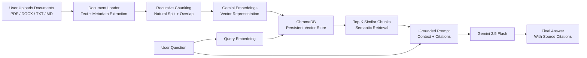
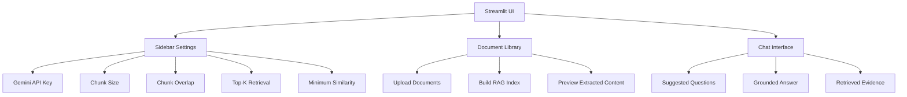
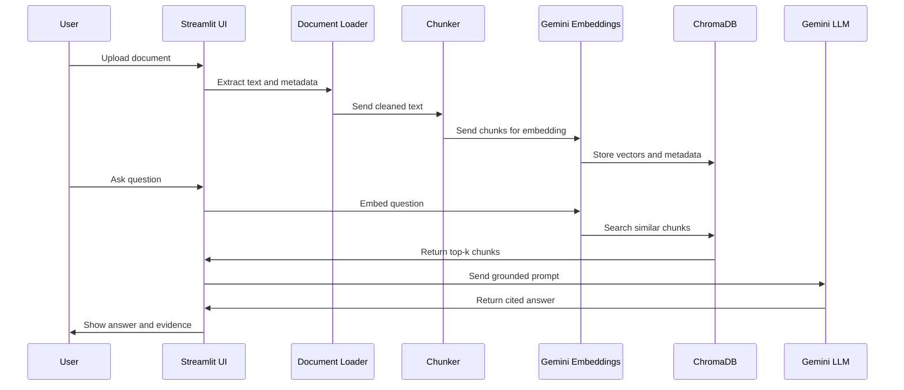

# Document Q&A Bot with RAG


A professional **Book Expert / Document Expert Q&A Bot** built with **Retrieval-Augmented Generation (RAG)**. The application lets users upload private books, PDFs, reports, DOCX files, TXT files, or Markdown documents, then ask natural-language questions and receive grounded answers with source citations.

This project is designed for internship evaluation: it demonstrates document ingestion, text extraction, chunking, embeddings, vector search, prompt engineering, Gemini integration, citation-aware generation, UI design, deployment readiness, and explainable software structure.

## Live Demo

- Streamlit App: `https://sayendranadh-document-qa-bot-app-gjzdzt.streamlit.app/`
- GitHub Repository: `https://github.com/sayendranadh/document-qa-bot`

Replace the Streamlit URL above with your deployed app link before final submission.

## Problem Statement

Large Language Models are powerful, but they have two major limitations:

1. They do not automatically know private files, books, internal reports, or uploaded documents.
2. They may hallucinate when asked about information that is not present in their training data.

This project solves that problem using **RAG**. Instead of asking Gemini to answer from memory, the app first retrieves relevant document chunks from a vector database and then asks Gemini to answer only from that retrieved context.

## Project Graphic: RAG Architecture



## What The Application Does

1. Accepts private documents from the user.
2. Extracts clean text from PDFs, DOCX files, TXT files, and Markdown files.
3. Preserves source metadata such as file name, page number, and chunk number.
4. Splits large text into overlapping chunks to keep context meaningful.
5. Converts chunks into embeddings using Gemini.
6. Stores those embeddings in ChromaDB.
7. Converts the user question into an embedding using the same embedding model.
8. Retrieves the most relevant chunks using vector similarity search.
9. Builds a strict prompt that tells Gemini to answer only from retrieved context.
10. Returns an answer with citations and shows the retrieved evidence.

## Book Expert Evaluation Focus

This project can be explained as a **Book Expert Bot** because it can read and reason over uploaded books or long documents without fine-tuning the LLM.

For example, after uploading a book, evaluator guide, internship brief, or PDF report, the user can ask:

- What is this document about?
- Summarize the main ideas.
- List the key concepts chapter-wise.
- Explain the purpose of the document.
- What requirements are mentioned?
- Which page supports this answer?

The bot does not simply guess. It retrieves relevant chunks and answers from that context.

## User Interface Highlights



Key UI features:

- Clean Streamlit web interface.
- Multiple document upload support.
- RAG index build button.
- Indexed file list.
- Extracted document preview.
- Suggested question buttons.
- Chat-style Q&A.
- Retrieved evidence panel with scores and citations.
- Similarity threshold warning to prevent accidental empty answers.

## Why RAG Is Used

RAG is used because it is more practical than fine-tuning for document Q&A.

| Approach | Limitation | Why RAG Is Better Here |
|---|---|---|
| Normal LLM prompt | May not know private documents | RAG injects retrieved document context |
| Fine-tuning | Expensive and not ideal for changing documents | RAG can index new files without retraining |
| Keyword search | Misses semantic meaning | Embeddings retrieve meaning-based matches |
| Manual reading | Slow for long books/reports | RAG gives quick answers with evidence |

## End-To-End Pipeline Explanation

### 1. Document Upload

The user uploads one or more documents through the Streamlit UI. Supported formats:

- PDF
- DOCX
- TXT
- Markdown

Main file: `src/document_loader.py`

### 2. Text Extraction

The app extracts readable text from each file.

- `pypdf` extracts page-level PDF text.
- `python-docx` extracts Word document paragraphs.
- TXT and Markdown files are decoded directly.

Each extracted item keeps metadata:

```python
{
    "text": "extracted page text",
    "source": "uploaded_file.pdf",
    "page": 4
}
```

### 3. Text Cleaning

The loader removes unnecessary whitespace, normalizes line breaks, and skips empty pages. This makes the later chunking and embedding stages cleaner.

### 4. Recursive Chunking

Large documents cannot be sent to the LLM as one huge block. The app splits text into smaller chunks using natural boundaries:

1. Paragraph breaks
2. Line breaks
3. Sentence endings
4. Commas
5. Spaces
6. Hard character boundary if needed

Main file: `src/chunker.py`

### 5. Chunk Overlap

The app adds overlap between chunks. This prevents losing important information when a useful sentence appears near the boundary between two chunks.

Default values:

- Chunk size: `1000` characters
- Chunk overlap: `180` characters

### 6. Embedding Generation

Each chunk is converted into a dense vector embedding.

Default embedding model:

```text
models/gemini-embedding-001
```

Main file: `src/embeddings.py`

### 7. Vector Storage

Embeddings are stored in ChromaDB. This allows semantic similarity search.

Main file: `src/vector_store.py`

### 8. Query Embedding

When the user asks a question, the app converts that question into an embedding using the same embedding model used for document chunks.

### 9. Similarity Search

The vector database returns the most relevant chunks.

Important controls:

- `Top K`: how many chunks to retrieve
- `Minimum similarity`: how strict the filtering should be

Recommended minimum similarity for evaluation:

```text
0.00 to 0.20
```

### 10. Prompt Engineering

The app builds a strict grounded prompt:

```text
Use ONLY the provided context to answer the user's question.
If the answer cannot be found in the context, say:
"I cannot find the answer in the provided documents."
Do not use your own knowledge.
```

Main file: `src/prompts.py`

### 11. Answer Generation

Gemini receives:

- The user question
- Retrieved chunks
- Source metadata
- Strict grounding instructions

Default generation model:

```text
gemini-2.5-flash
```

Main file: `src/generator.py`

### 12. Citations And Evidence

The final answer includes citations. The UI also shows the retrieved evidence so the evaluator can verify whether the answer is grounded in the uploaded document.

## Sequence Diagram



## Project Structure

```text
document-qa-bot/
|-- app.py                         # Streamlit deployment entrypoint
|-- ingest.py                      # CLI wrapper for one-time ingestion
|-- query.py                       # CLI wrapper for querying existing DB
|-- requirements.txt               # Python dependencies
|-- runtime.txt                    # Python runtime for deployment
|-- .env.example                   # Example environment variables
|-- .gitignore                     # Ignores secrets, venvs, DB files
|-- DEPLOYMENT.md                  # Deployment instructions
|-- PROJECT_EXPLANATION.md         # Interview explanation
|-- SUBMISSION_CHECKLIST.md        # Final submission checklist
|-- VIDEO_SCRIPT.md                # Screen recording script
|-- data/                          # Sample evaluation documents
|-- sample_documents/              # Extra demo document
|-- scripts/
|   |-- check_gemini.py             # Gemini health check
|   |-- create_sample_documents.py  # Generates sample PDF/DOCX files
|-- src/
|   |-- __init__.py
|   |-- config.py                   # Runtime configuration
|   |-- document_loader.py          # PDF, DOCX, TXT, MD loading
|   |-- chunker.py                  # Recursive chunking logic
|   |-- embeddings.py               # Gemini and offline embeddings
|   |-- vector_store.py             # ChromaDB storage/search
|   |-- prompts.py                  # Grounded prompt template
|   |-- generator.py                # Gemini answer generation
|   |-- rag_pipeline.py             # End-to-end RAG orchestration
|   |-- ingest.py                   # Persistent indexing workflow
|   |-- query.py                    # CLI Q&A workflow
|   |-- main.py                     # Streamlit UI
|-- tests/
|   |-- test_chunker.py
|   |-- test_document_loader.py
|   |-- test_vector_store.py
```

## Tech Stack

| Layer | Tool |
|---|---|
| Language | Python 3.11+ |
| Web UI | Streamlit |
| PDF parsing | pypdf |
| DOCX parsing | python-docx |
| Embeddings | Gemini embedding model |
| LLM | Gemini 2.5 Flash |
| Vector database | ChromaDB |
| Environment variables | python-dotenv |
| Progress bars | tqdm |
| Testing | unittest |

## Installation

```powershell
python -m venv venv
.\venv\Scripts\activate
pip install -r requirements.txt
copy .env.example .env
```

Add your Gemini API key to `.env`:

```env
GEMINI_API_KEY=your_gemini_api_key_here
GEMINI_CHAT_MODEL=gemini-2.5-flash
GEMINI_EMBEDDING_MODEL=models/gemini-embedding-001
```

Run the app:

```powershell
streamlit run app.py
```

In this workspace, the verified Python 3.12 environment is `venv312`:

```powershell
.\venv312\Scripts\activate
streamlit run app.py
```

## Gemini Health Check

Run this before evaluation:

```powershell
.\venv312\Scripts\python.exe scripts\check_gemini.py
```

Expected result:

```text
Gemini embedding request succeeded.
Gemini generation request succeeded.
```

## Persistent CLI Workflow

Build a reusable ChromaDB index:

```powershell
python ingest.py --documents data --db-path db --collection document_qa
```

Ask a question using the saved index:

```powershell
python query.py --db-path db --collection document_qa --question "Summarize the document."
```

Offline demo mode:

```powershell
python ingest.py --documents data --db-path db --collection document_qa --offline
python query.py --db-path db --collection document_qa --question "Why does RAG reduce hallucination?" --offline
```

## Evaluation Demo Steps

1. Open the deployed Streamlit app.
2. Enter the Gemini API key if it is not already configured in Streamlit secrets.
3. Upload a PDF, DOCX, TXT, or Markdown document.
4. Click `Build RAG Index`.
5. Check `Preview extracted document content`.
6. Keep `Minimum similarity` around `0.00` to `0.20`.
7. Click `Summarize Document` or ask a custom question.
8. Open `Retrieved evidence`.
9. Explain how the answer is grounded in source chunks.

## Important Evaluation Questions And Answers

### Why did you use RAG?

RAG allows the model to answer from private documents without retraining. It retrieves relevant chunks first and then asks the LLM to answer from that context.

### Why did you use ChromaDB?

ChromaDB is lightweight, local, persistent, and easy to use for vector similarity search. It is suitable for a focused internship proof of concept.

### Why do you chunk the document?

Chunking keeps the context small, relevant, and affordable. It also helps retrieve only the parts of the document that are useful for a question.

### Why use chunk overlap?

Overlap prevents losing context when important information appears near the boundary between chunks.

### How do you reduce hallucinations?

The prompt tells Gemini to use only retrieved context. If the answer is not found in the context, the app instructs Gemini to say that it cannot find the answer in the provided documents.

### How are citations created?

Each chunk stores metadata such as file name and page number. The prompt includes this metadata, and the UI displays retrieved evidence with citations.

### What happens if retrieval is weak?

The UI shows similarity scores and warns when the minimum similarity threshold is too strict. This helps the user tune retrieval instead of receiving confusing empty answers.

## Testing

```powershell
python -m unittest discover -s tests
python -m compileall src scripts tests
```

Validated checks:

- Document loading tests
- Chunking tests
- Vector search tests
- Python compilation checks
- Gemini synthetic health check

## Deployment

This project is deployed using Streamlit Community Cloud.

Deployment requirements:

- `app.py` as the entrypoint
- `requirements.txt` for dependencies
- `runtime.txt` for Python runtime
- Streamlit secrets for `GEMINI_API_KEY`

Example Streamlit secrets:

```toml
GEMINI_API_KEY = "your_gemini_api_key_here"
GEMINI_CHAT_MODEL = "gemini-2.5-flash"
GEMINI_EMBEDDING_MODEL = "models/gemini-embedding-001"
CHROMA_PERSIST_DIRECTORY = "db"
```

## Limitations

- Scanned image-only PDFs need OCR, which is not included in this version.
- Very large document collections should use background ingestion jobs.
- Production systems should add authentication and document-level access control.
- The current app is designed as a polished internship proof of concept, not a multi-tenant enterprise system.

## Future Improvements

- OCR support for scanned books and handwritten pages.
- Chapter-level summaries for long books.
- Conversation memory grounded in retrieved context.
- User authentication.
- Managed vector database for production scale.
- Downloadable answer reports with citations.

## Final Submission Checklist

- Public GitHub repository link
- Deployed Streamlit app link
- Screen recording link
- README with architecture and explanation
- Gemini API key stored only in `.env` or Streamlit secrets
- `.env`, virtual environments, and local DB files excluded from Git

## One-Line Summary

This project is a deployed, evaluation-ready **Book Expert RAG Bot** that converts private documents into searchable knowledge and uses Gemini to produce grounded, citation-backed answers.
